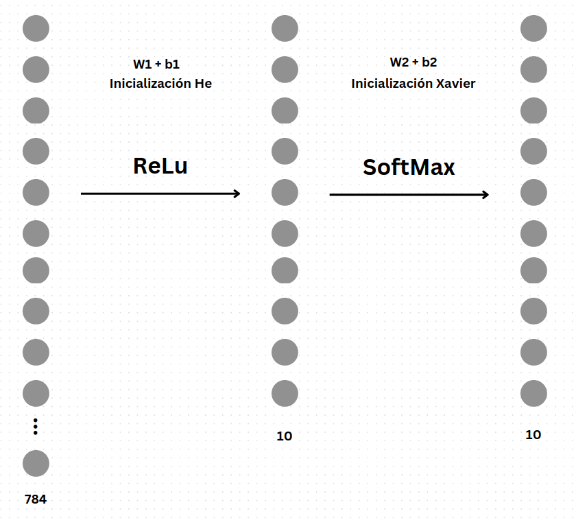

# 🧠 Optimización Evolutiva de Redes Neuronales para MNIST

[](https://opensource.org/licenses/MIT)
[](https://www.python.org/)

Algoritmo Genético para optimizar los pesos de una red neuronal en la clasificación de dígitos manuscritos (MNIST)


*Arquitectura de la red neuronal 784-25-10*

## 📌 Características Principales

- **Algoritmo Evolutivo**: Optimización de pesos mediante estrategias genéticas
- **Paralelización**: Uso de Joblib para evaluación de aptitud en múltiples núcleos
- **Regularización L2**: Prevención de sobreajuste con coeficiente λ = 0.0001
- **Visualización Interactiva**: Gráficos de progreso y predicciones
- **MNIST Benchmark**: 85.4% de precisión en conjunto de prueba

## 📋 Tabla de Contenidos
- [Instalación](#🔧-instalación)
- [Uso](#🚀-uso)
- [Resultados](#📊-resultados)
- [Tecnologías](#🛠️-tecnologías)
- [Contribución](#🤝-contribución)
- [Licencia](#📄-licencia)

## 🔧 Instalación

### Requisitos Previos
- Python 3.8 o superior.
- Gestor de paquetes `pip`.

### Pasos para Instalar
1. Clona el repositorio:
```bash
git clone https://github.com/tuusuario/optimizacion-redes-geneticas.git
cd optimizacion-redes-geneticas
```
2. Instala las dependencias:
```bash 
pip install -r requirements.txt
```
## 🛠️ Tecnologías

- 
- 
- 
- 
- 
